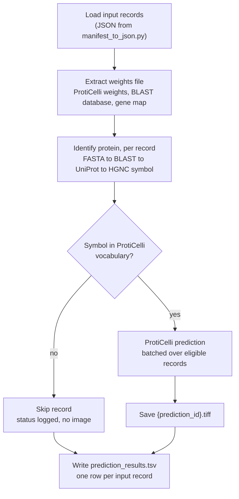

# BLAST-ProtiCelli baseline

A baseline submission for the CM4AI DREAM Challenge on predicting protein subcellular localization. Given reference images of a cell (microtubules, nucleus, ER) and the amino acid sequence of a protein, it generates a predicted fluorescence image of where that protein localizes.

The pipeline has two stages:

1. **Protein identification.** The amino acid sequence is searched with BLAST against a local database of reviewed human UniProt (Swiss-Prot) entries. The top hit's UniProt accession is mapped to an Ensembl gene ID and HGNC symbol with a local gene map. No network access is used at runtime.
2. **Image prediction.** The HGNC symbol and the three reference channels are passed to [ProtiCelli](https://github.com/CellProfiling/ProtiCelli), which generates the predicted image.

ProtiCelli uses a learned embedding for each protein it was trained on, so it can only predict proteins in its vocabulary (12,809 HGNC symbols in `proticelli/data/antibody_map.pkl`). Records whose protein falls outside that vocabulary are skipped and reported, not failed.



This repository is a fork of ProtiCelli, developed by the Lundberg lab. The original documentation is in [`docs/PROTICELLI_README.md`](docs/PROTICELLI_README.md).

## Repository layout

| Path | Purpose |
|---|---|
| `run_inference.py` | Runs the full pipeline over a set of input records |
| `Dockerfile` | Inference image: BLAST+, the ProtiCelli package, and the pipeline scripts |
| `protein_predictor.py` | Amino acid sequence to UniProt accession, Ensembl gene ID, and HGNC symbol |
| `pipeline_checks.py` | Channel assembly and optional input validation |
| `scripts/manifest_to_json.py` | Converts a manifest TSV into the input JSON |
| `scripts/build_human_blast_db.sh` | Builds the reference BLAST database zip |
| `scripts/build_human_gene_map.sh` | Builds the reference gene map zip |
| `scripts/build_weights_zip.sh` | Assembles the weights file from the model weights and reference zips |
| `scripts/split_reference_channels.py` | Splits a multichannel reference image into single-channel files (test data preparation) |
| `blast_proticelli.wdl` | WDL workflow wrapping `run_inference.py` for Terra or miniWDL |
| `scripts/make_wdl_inputs.py` | Builds the WDL inputs JSON from the input records |
| `manifest.tsv`, `test_image_reference_input/`, `test_fasta_reference_input/` | Two-record example: manifest, split reference images, and FASTA files |

## Inputs

### Records

Each prediction is one record: three single-channel reference images plus one FASTA file holding a single amino acid sequence.

```json
[
  {
    "prediction_id": "cell_0",
    "microtubules_image": "/path/to/cell_0_microtubules.tiff",
    "er_image": "/path/to/cell_0_er.tiff",
    "nucleus_image": "/path/to/cell_0_nucleus.tiff",
    "fasta_file": "/path/to/cell_0.faa"
  }
]
```

`prediction_id` must be unique within a run; it becomes the output filename. The same reference images may appear in several records paired with different FASTA files.

Inputs are assumed to already meet ProtiCelli's requirements: matching height and width across the three channels, and pixel values normalized to ProtiCelli's expected range. No resampling or normalization happens in this pipeline.

To generate the JSON from a manifest TSV (which must include a `prediction_id` column):

```bash
python scripts/manifest_to_json.py manifest.tsv -o inputs.json
```

Relative paths in the manifest are resolved against the manifest's directory by default, or against `--path-prefix` (for example a `gs://` bucket path on Terra).

The repository includes a two-record example (`manifest.tsv`, `test_image_reference_input/`, `test_fasta_reference_input/`). The reference images are the ProtiCelli repository's `example_cell_reference_input` images (Lundberg lab), split into single-channel files with `scripts/split_reference_channels.py`. The two FASTA files are different ADK isoforms; both map to the same UniProt entry (P55263), at 100% identity over 362 residues and 99.4% over 343.

### Weights file

Everything the model needs at runtime ships in a single zip:

```
blast_proticelli_weights_v2.zip
    checkpoint/unet/                ProtiCelli model weights (loaded for inference)
    checkpoint/unet_ema/            ProtiCelli EMA weights (not currently loaded; see open items)
    vae/                            ProtiCelli VAE weights
    reference/human_blast_db.zip    BLAST database
    reference/human_gene_map.zip    UniProt to Ensembl and HGNC map
```

ProtiCelli's training state (`optimizer.bin`, `scheduler.bin`, `random_states_*.pkl`) is not included. Inference does not read it, and leaving it out removes about 3.5 GB; outputs with and without it differ only by run-to-run GPU noise.

`run_inference.py` checks that `checkpoint/unet/` exists before predicting. Without it, ProtiCelli silently falls back to a randomly initialized model and still writes images, so a malformed weights file would otherwise produce plausible-looking but meaningless predictions.

The BLAST database and gene map are packaged with the model weights because they define which proteins this baseline can recognize, in the same way ProtiCelli's weights and vocabulary do. Each reference zip contains a `PROVENANCE.txt` recording its UniProt query, build date, and, for zips built after 2026-09-28, the UniProt release it was downloaded from.

The weights file is not stored in git. See [Weights builds](#weights-builds) for released versions.

## Running

```bash
python run_inference.py \
  --inputs inputs.json \
  --weights_zip blast_proticelli_weights_v2.zip \
  --output_dir predictions/test_run
```

Optional arguments:

| Argument | Default | Purpose |
|---|---|---|
| `--cell_line` | none | ProtiCelli cell line name applied to every record; omit to run without cell line conditioning |
| `--seed` | none | Random seed; on Apple GPUs (MPS) results are near-identical, not bit-identical, across runs |
| `--num_inference_steps` | 50 | Diffusion sampling steps |
| `--batch_size` | 4 | ProtiCelli prediction batch size |
| `--weights_dir` | `./weights` | Where model weights are extracted |
| `--reference_data_dir` | `./reference_data` | Where the BLAST database and gene map are extracted |
| `--antibody_map` | package copy | Override path to ProtiCelli's vocabulary file |

Weights always extract to a run-local directory, never into the installed `proticelli` package, so each run uses the weights file it was given. Any `LOCAL_BLAST_DB` or `LOCAL_GENE_MAP` environment variables left over from development are ignored for the same reason.

### In Docker

The image holds code only (Python 3.11, BLAST+ 2.17.0, the ProtiCelli package, and the pipeline scripts in `/app`); weights and reference data arrive at runtime in the weights file. Build for x86_64, which Terra uses, including on Apple Silicon:

```bash
docker buildx build --platform linux/amd64 -t blast-proticelli:0.1.0 --load .
```

The build fails if the ProtiCelli vocabulary files are missing from the installed package, if `blastp` cannot run, or if the pipeline imports fail.

To test locally, mount the working directory at the same path so absolute paths in `inputs.json` still resolve, and extract weights inside the container:

```bash
docker run --rm --platform linux/amd64 -v "$PWD":"$PWD" -w "$PWD" blast-proticelli:0.1.0 \
  python /app/run_inference.py --inputs inputs.json \
  --weights_zip blast_proticelli_weights_v2.zip \
  --weights_dir /tmp/weights --reference_data_dir /tmp/reference_data \
  --output_dir predictions/docker
```

On a Mac this runs under emulation on the CPU and is slow; `--num_inference_steps 10` is useful for a quick functional test, though fewer steps give visibly rougher images.

### With WDL

`blast_proticelli.wdl` runs all records in one task, so the model loads once; splitting records across tasks is left to the caller. Records are declared as a WDL struct, so every image and FASTA file is a `File` that the workflow engine copies into the task.

| Input | Type | Default |
|---|---|---|
| `records` | `Array[PredictionInput]` (the records described above) | required |
| `weights_file` | `File` | required |
| `docker` | `String` | required |
| `cell_line` | `String?` | none |
| `seed` | `Int?` | none |
| `num_inference_steps` | `Int` | 50 |
| `batch_size` | `Int` | 4 |

Outputs are `predictions` (`Array[File]`, the TIFFs) and `prediction_results` (the TSV). Task resources default to Terra's g2-standard-8 (8 CPUs, 32 GiB, 75 GB SSD, one NVIDIA L4) and can be overridden as task inputs. Each run first logs `nvidia-smi` and whether PyTorch can use CUDA, so a silent fall back to the CPU shows at the top of the task log.

To run locally with miniWDL:

```bash
python scripts/manifest_to_json.py manifest.tsv -o inputs.json
python scripts/make_wdl_inputs.py \
  --records inputs.json \
  --weights_file blast_proticelli_weights_v2.zip \
  --docker blast-proticelli:0.1.0 \
  -o wdl_inputs.json
MINIWDL__FILE_IO__OUTPUT_HARDLINKS=true miniwdl run blast_proticelli.wdl -i wdl_inputs.json
```

The environment variable makes miniWDL write outputs as ordinary files rather than symlinks; `_LAST/outputs.json` lists where they are. For Terra, generate the records with `--path-prefix gs://<bucket>/<folder>` and pass the weights file and Docker image by their bucket and registry addresses.

For a step-by-step run of the two-record example, see [docs/WORKED_EXAMPLE.md](docs/WORKED_EXAMPLE.md).

## Outputs

All outputs are written flat into `--output_dir`:

- `{prediction_id}.tiff`, one per record that could be predicted
- `prediction_results.tsv`, one row per input record, predicted or not

### Status values

| Status | Meaning |
|---|---|
| `predicted` | Image generated |
| `no_blast_hit` | BLAST ran but returned no hit |
| `no_hgnc_symbol` | A UniProt hit was found, but no HGNC symbol mapped to it |
| `not_in_model_vocabulary` | The protein was identified, but ProtiCelli was not trained on it |
| `predictor_error` | BLAST or gene mapping raised an error (details in `predictor_error`) |

If every record returns `predictor_error`, the run fails, since that points to a broken environment (for example a missing `blastp` binary or a malformed reference zip) rather than to the data.

### Results columns

| Column | Content |
|---|---|
| `prediction_id` | From the input record |
| `status` | See above |
| `output_file` | Image filename, empty if not predicted |
| `predicted_uniprot_accession` | Top BLAST hit |
| `predicted_ensembl_gene_id` | Mapped Ensembl gene ID |
| `predicted_hgnc_symbol` | Mapped HGNC symbol, passed to ProtiCelli |
| `percent_identity`, `e_value`, `alignment_length` | Top hit statistics |
| `gene_candidate_count`, `mapping_ambiguous` | Whether the accession mapped to more than one Ensembl gene |
| `search_database` | BLAST database path used |
| `predictor_pipeline_version` | Protein predictor version |
| `predictor_error` | Error message, if any |
| `cell_line`, `seed`, `num_inference_steps` | Run settings |
| `run_id` | Short random identifier shared by all rows of one run |

## Building the weights file

1. Build the reference zips with `scripts/build_human_blast_db.sh` and `scripts/build_human_gene_map.sh` (usage in each script's header). Both pull from the current UniProt release, so rebuilding later produces different content; keep built zips rather than relying on rebuilding them.
2. Obtain the ProtiCelli `checkpoint/` and `vae/` folders, for example by running ProtiCelli's `download_checkpoints()`, which fetches them from the Lundberg lab. The build script packages only `checkpoint/unet`, `checkpoint/unet_ema`, and `vae`, and stops if any is missing.
3. Assemble the weights file:

```bash
scripts/build_weights_zip.sh proticelli \
  human_blast_db/human_blast_db.zip \
  human_gene_map/human_gene_map.zip \
  blast_proticelli_weights_v2.zip
```

The script prints the top-level contents and the SHA-256 checksum. Record every build in the table below.

## Weights builds

| Version | Built | UniProt release (date) | ProtiCelli weights | SHA-256 | Location | Notes |
|---|---|---|---|---|---|---|
| v1 | 2026-09-28 | 2026_03 (2026-09-02), inferred |  Lundberg lab default `download_checkpoints()` URLs | `19fc815a99449e80eb2c703602aa58a5c92103225efb8203dca738b9cd9c0566` | local only (not yet uploaded) | Verified end to end on two test records. Includes ProtiCelli training state files (about 6.5 GB). UniProt release inferred: reference zips built 2026-09-23, when 2026_03 was current; not recorded by the v1 build scripts. |
| v2 | 2026-09-28 | 2026_03 (2026-09-02) | Same as v1 | `2f243c8e0945b5b9830fafae1590c92638415501e7aa6c6db71da3161ed07071` | local only (not yet uploaded) | Training state removed, bringing the file to about 3.6 GB. Same model weights and reference zips as v1; outputs match v1 within MPS run-to-run noise. Verified in Docker. |

## Open items

- **Input normalization and output rescaling.** The pipeline currently assumes inputs are already normalized for ProtiCelli, and writes predictions in ProtiCelli's native output range ([0, 1]). Once real challenge images are available, it needs a normalization step using ProtiCelli's own code, and a matching rescaling of outputs back to the input intensity scale. The rescaling cannot be designed with the current test images, since how they were scaled is unknown.
- **EMA weights.** ProtiCelli's `Model.model` loads `checkpoint/unet` (`_load_model()` defaults to `use_ema=False`), while its fine-tuning path loads `checkpoint/unet_ema`, and its `download.py` docstring lists only `unet_ema`. EMA weights are commonly the ones used for sampling in diffusion models, so whether inference should use them is a question for the Lundberg lab. Both folders are kept until then; dropping the unused one would save a further 1.7 GB.
- **Reproducibility on Apple GPUs.** With a fixed seed, repeated runs on MPS differ by up to about 0.05% of the output range. Whether CUDA runs on Terra are bit-identical is untested.
- **Handling of skipped records.** Skipping out-of-vocabulary proteins and failing only on all-error runs are provisional choices; how skipped records are scored is a challenge design question.
- **`cell_line`.** Currently a single optional value applied to every record in a run.
- **GPU driver on Terra.** The image's PyTorch is built for CUDA 13.0, which needs a recent NVIDIA driver (roughly 580 or newer). Terra's g2-standard-8 machines have NVIDIA L4 GPUs, which support it, but the driver version is set by the machine image and is unknown. With an older driver, PyTorch would silently fall back to the CPU. The first Terra run should confirm the device in use; if needed, pin PyTorch to a CUDA 12 build.
- **Terra.** The workflow has run under miniWDL but not yet on Terra. That needs the Docker image pushed to a registry Terra can pull from, and the weights file and test inputs uploaded to the workspace bucket.